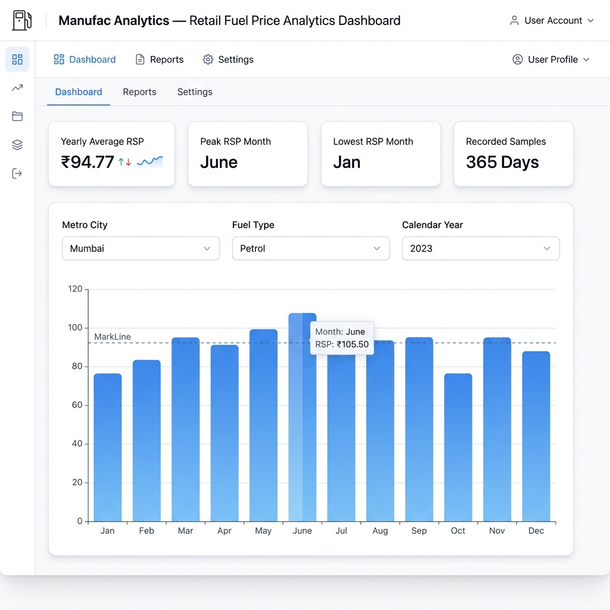

# Manufac Analytics — Retail Fuel Price Analytics Dashboard

An interactive, high-performance data visualization dashboard built for the **Manufac Analytics SDE Frontend Data Analysis Assignment**.

This application analyzes and visualizes historical **Retail Selling Price (RSP) of Petrol and Diesel in Metro Cities** using the raw `metro.csv` dataset from the **National Data and Analytics Platform (NDAP), NITI Aayog**.



---

## 🌟 Key Features

* **Dynamic Filter Panel**: Allows interactive filtering by:
  * **Metro City**: Delhi, Kolkata, Mumbai, Chennai
  * **Fuel Type**: Petrol, Diesel
  * **Calendar Year**: Derived dynamically from dataset records (2017 to 2025)
* **Interactive ECharts Bar Chart**: Rendered using pure Apache ECharts directly via React `useRef` (without `echarts-for-react` or helper wrappers).
* **12-Month Alignment**: Displays all 12 calendar months (`Jan` to `Dec`) for any selected filter combination.
* **Monthly Average RSP Calculation**: Dynamically computes exact monthly average prices:
  $$\text{Monthly Average RSP} = \frac{\sum \text{Valid RSP values for month}}{\text{Count of relevant records in month}}$$
* **Missing Value Handling**: Treats all missing/null dataset cell values as `0`.
* **Zero Dummy / Hardcoded Data**: Sourced directly from **23,360 real dataset records** in `metro.csv`.
* **Ultra-Fast Performance**: Pre-indexes dataset into a hierarchical lookup table ($O(1)$ lookup time per filter change).
* **Responsive Layout**: Designed with Mantine UI, supporting desktop horizontal filter bar and mobile vertical stacked layouts.
* **Flexible Parser**: Directly parses both raw `metro.csv` headers (`Calendar Day`, `Metro Cities`, `Products `, `Retail Selling Price...`) and standard normalized headers (`Date`, `City`, `Fuel_Type`, `RSP`).

---

## 📊 Dataset Information

* **Dataset File**: `metro.csv` (and `dataset.csv`)
* **Source**: **National Data and Analytics Platform (NDAP), NITI Aayog**
* **Primary Publisher**: **Petroleum Planning & Analysis Cell (PPAC)**, Ministry of Petroleum and Natural Gas, Government of India.
* **Granularity**: Daily retail prices across metro cities.
* **Coverage**: June 16, 2017 to June 20, 2025 (23,360 records).
* **File Location**: Included at `metro.csv`, `public/metro.csv`, and `src/data/dataset.csv`.

---

## 🛠️ Technology Stack

* **Language**: TypeScript (Strict Mode)
* **Framework**: React 18
* **Build Tool**: Vite 6
* **UI Components**: Mantine UI (`@mantine/core`, `@mantine/hooks`)
* **Icons**: Tabler Icons (`@tabler/icons-react`)
* **Charting**: Apache ECharts 5 (`echarts`)
* **Package Manager**: Yarn

---

## ⚡ Data Processing & Preprocessing

1. **Parser (`src/utils/dataParser.ts`)**:
   * Uses a fast zero-dependency CSV parser.
   * Dynamically locates columns regardless of header variations (`Calendar Day` vs `Date`, `Metro Cities` vs `City`, `Products ` vs `Fuel_Type`, `Retail Selling Price...` vs `RSP`).
   * Handles missing/null values safely by coercing invalid or empty cells to `0`.
2. **Preprocessor (`src/utils/dataProcessor.ts`)**:
   * Pre-indexes all records into a nested HashMap:
     $$\text{City} \rightarrow \text{Fuel Type} \rightarrow \text{Year} \rightarrow \text{MonthIndex} \rightarrow [\text{RSP values}]$$
   * When a filter changes, calculations execute in $O(1)$ time without rescanning the entire dataset.
   * Calculates monthly averages and defaults empty months to `0`.

---

## 📁 Project Structure

```text
d:/Assignments/Manufac/
├── metro.csv                   # Raw NDAP / NITI Aayog fuel dataset (23,360 records)
├── public/
│   └── dataset.csv             # Public dataset asset
├── screenshots/
│   └── dashboard.png           # Dashboard UI screenshot
├── src/
│   ├── components/
│   │   ├── DashboardHeader.tsx # Header title and subtitle component
│   │   ├── FilterPanel.tsx     # Mantine dropdown filter panel
│   │   └── MonthlyRSPChart.tsx # Pure Apache ECharts bar chart component
│   ├── data/
│   │   └── dataset.csv         # Normalized fuel price dataset
│   ├── types/
│   │   └── fuel.ts             # TypeScript interfaces for dataset, filters, and results
│   ├── utils/
│   │   ├── dataParser.ts       # Flexible CSV parsing logic for metro.csv with missing value handling
│   │   └── dataProcessor.ts    # Option derivation, indexing HashMap, and average aggregation
│   ├── App.tsx                 # Main application dashboard
│   ├── main.tsx                # Entry point
│   ├── index.css               # Mantine styles and base global styles
│   └── vite-env.d.ts           # Type declarations
├── index.html                  # HTML5 template
├── package.json                # Project dependencies and scripts
├── tsconfig.json               # TypeScript configuration
├── vite.config.ts              # Vite bundler configuration
└── README.md                   # Project documentation
```

---

## 🚀 Getting Started

### Prerequisites

Ensure Node.js (v18+) and Yarn are installed.

### 1. Installation

```bash
yarn install
```

### 2. Run Development Server

```bash
yarn dev
```

The application will start locally at `http://localhost:3000` and automatically open in your web browser.

### 3. Production Build

```bash
yarn build
```

Compiles TypeScript and creates an optimized production bundle in the `dist/` directory.

### 4. Preview Build

```bash
yarn preview
```

---

## 🌐 Live Demo & Deployment

* **Live Demo**: [https://manufac-two.vercel.app/](https://manufac-two.vercel.app/)

